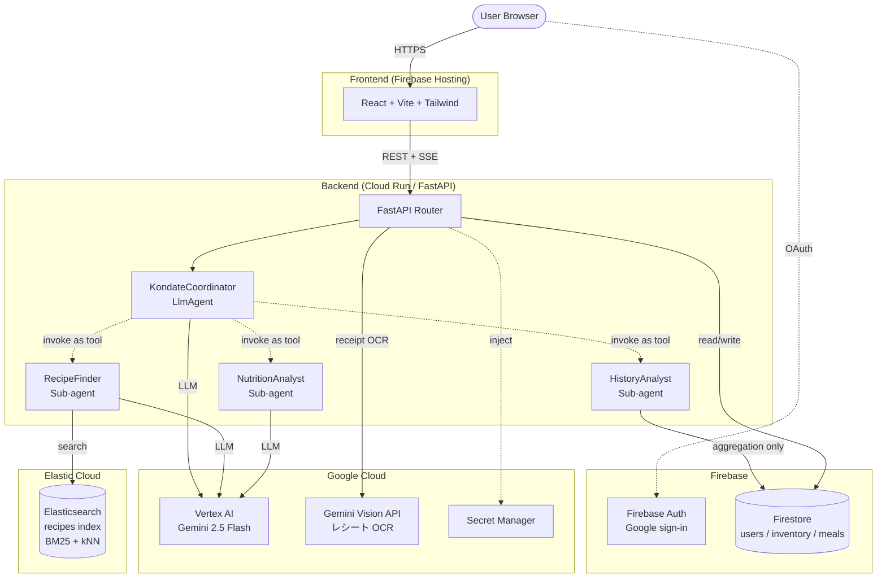
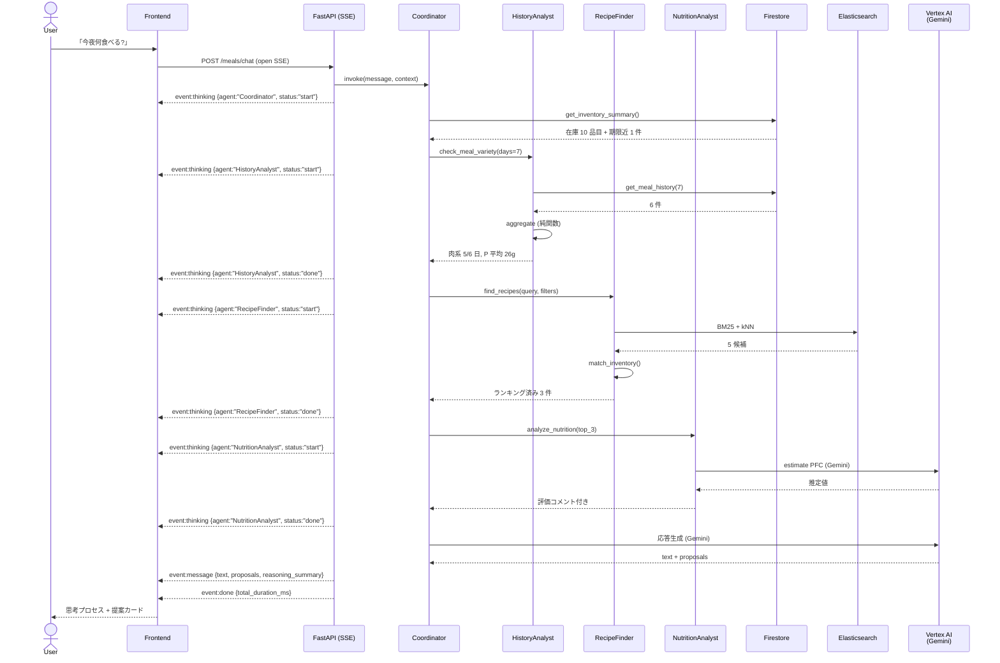
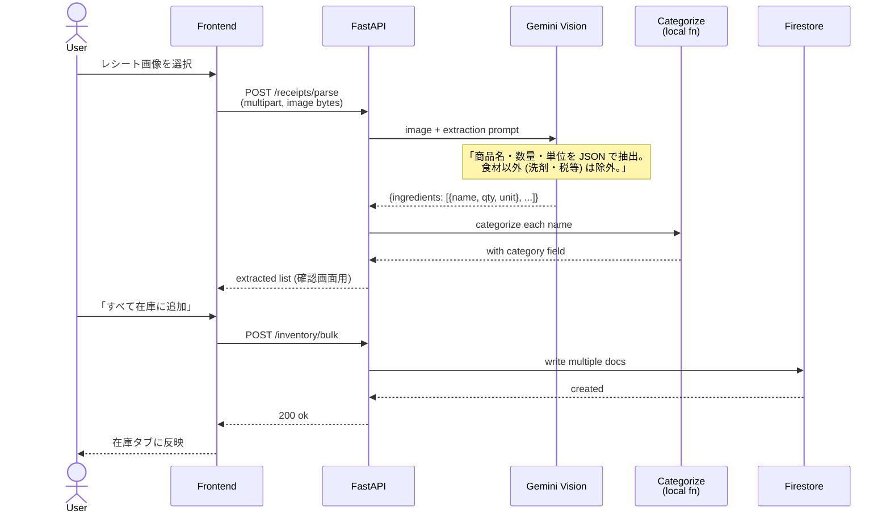
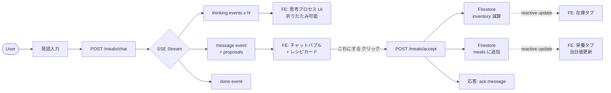
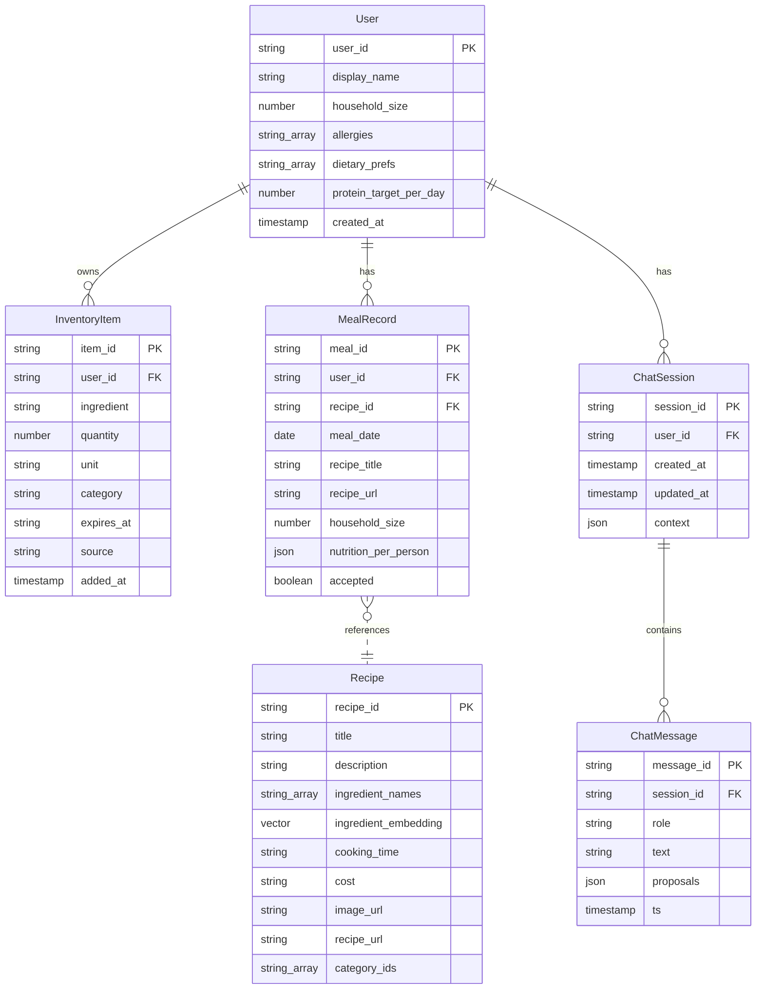
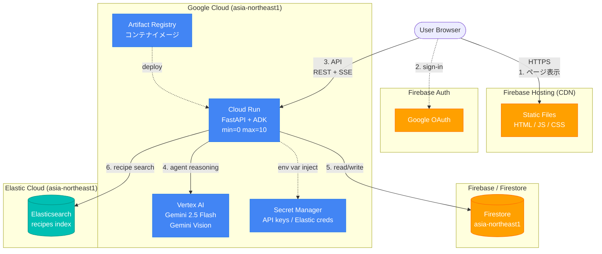
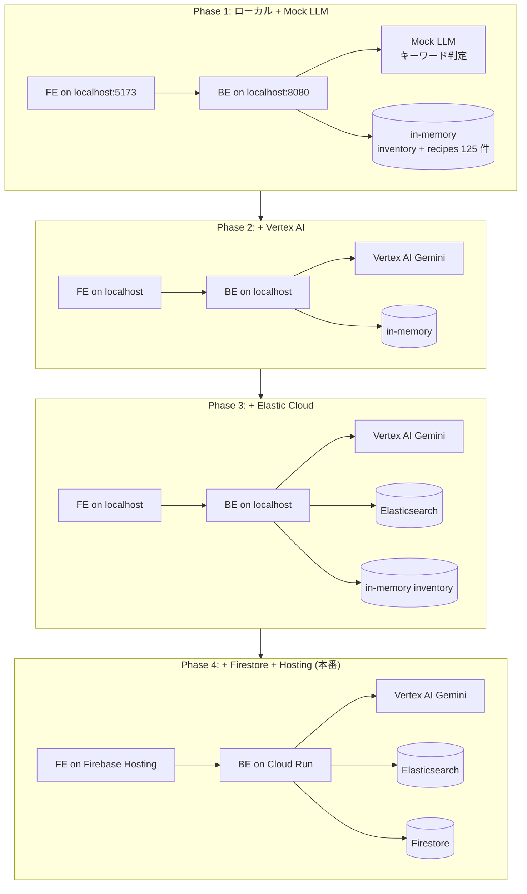
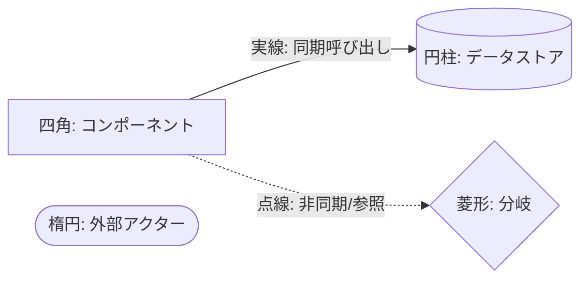

# SYSTEM_DESIGN.md

kondate-agent のシステム設計書 (図入り)。
図は Mermaid で書いてあるので、VSCode の Markdown Preview、GitHub、Notion 等でそのまま見られる。

関連ドキュメント:
- [CLAUDE.md](../CLAUDE.md) — 全体仕様 / 技術スタック
- [AGENT_DESIGN.md](./AGENT_DESIGN.md) — エージェント設計の哲学
- [AGENT_SCENARIOS.md](./AGENT_SCENARIOS.md) — 会話フロー例
- [API_CONTRACT.md](./API_CONTRACT.md) — API 契約・ツールシグネチャ
- [ELASTIC_SCHEMA.md](./ELASTIC_SCHEMA.md) — 検索インデックス

---

## 1. 全体アーキテクチャ

ユーザのブラウザから AI エージェントまでの構成。Cloud Run の中で 4 つのエージェントが協調する。

**ポイント:**
- 4 エージェントが Cloud Run の 1 プロセス内で動く (Coordinator が他 3 つを「ツール」として呼ぶ)
- HistoryAnalyst は集計が主なので LLM 不要 (純関数 + 軽量 LLM のハイブリッド予定)
- レシピ検索だけ Elastic Cloud、それ以外の永続化は Firestore に集約

---

## 2. エージェント協調シーケンス (献立提案 1 ターン)

「今夜何食べる?」と聞かれてから、エージェントが思考プロセスを SSE で逐次返すまでの流れ。

**ポイント:**
- 各サブエージェント呼び出し前後で `thinking` イベントが流れる → UI で「いま何を考えてるか」が見える
- HistoryAnalyst → RecipeFinder → NutritionAnalyst の **順序に意味がある** (履歴 = 提案方向の決定 → 検索 = 候補絞り → 栄養 = 最終選定)
- Coordinator は LLM 判断で「順序を変える」自由度を持つ (例: 食材指定型のシナリオ 5 では HistoryAnalyst をスキップ)

---

## 3. レシート登録フロー

レシート画像から Gemini Vision で食材を抽出し、在庫に追加するまで。

**ポイント:**
- Gemini Vision を「商品名から食材だけ抽出」に特化させる (税・容器・割引等は無視)
- 自動カテゴリ判定 (categorize) は LLM 不要の純関数なので BE 側で完結
- ユーザが内容を確認してから一括追加 (誤抽出時の修正余地を残す)

---

## 4. データフロー (献立提案の Lifecycle)

ユーザが発話してから「これにする」で在庫が減って栄養に記録されるまで。

**ポイント:**
- 提案 (POST /meals/chat) と採用 (POST /meals/accept) は別エンドポイント = 「提案が出ても採用するとは限らない」を素直に表現
- Firestore の Reactive リスナを使えば、栄養タブ・在庫タブはリアルタイム反映される

---

## 5. データモデル (ER 図)

Firestore コレクションと Elasticsearch インデックスの関係。

**保存場所:**
- `Recipe` (太線) → **Elasticsearch** (検索専用、楽天レシピを取り込んだもの)
- それ以外 → **Firestore**
- `MealRecord.recipe_id` は ES 側の主キーを参照する弱いリレーション (cross-store)

---

## 6. デプロイ構成

本番デプロイ時のリソース配置とトラフィックの流れ。

**ポイント:**
- すべて東京リージョン (`asia-northeast1`) で統一 → レイテンシ最小化
- Cloud Run は `min=0` で課金抑制 (cold start はあるが MVP では許容)
- Secret Manager で API キーを管理 (環境変数として注入)
- ハッカソン提出後に料金が増えないよう、すべて無料枠 or 従量課金最小

---

## 7. Phase 別の構成変化

実装ステージごとに、上記アーキテクチャのどの部分が動いてるかを示す。

各 Phase の達成基準:

| Phase | 達成基準 | 必要な準備 |
|---|---|---|
| **1** | 思考プロセス UI + チャット動作確認 (ローカル) | なし |
| **2** | 本物の Gemini で動的提案 | GCP プロジェクト + Vertex AI 有効化 |
| **3** | 125 件のレシピを実検索 (BM25) | Elastic Cloud デプロイ |
| **4** | デプロイ + 認証 + データ永続化 | Firebase / Cloud Run / Secret Manager |

---

## 付録: 凡例

